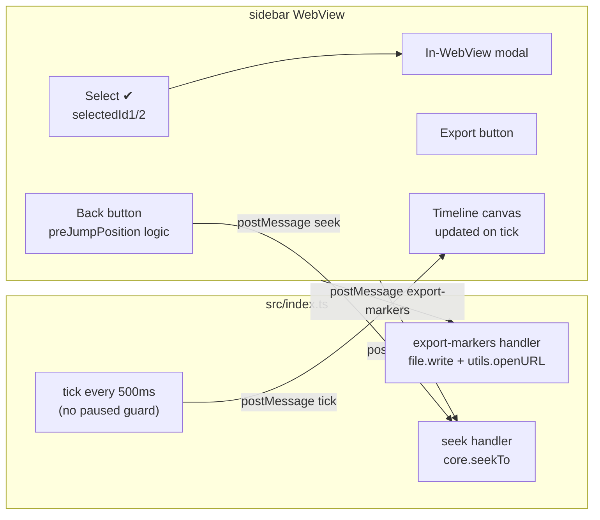

# VideoMarkers — план доработки

## Изменяемые файлы

- `[src/index.ts](src/index.ts)` — tick без паузы-гварда, обработчик export
- `[ui/sidebar/script.ts](ui/sidebar/script.ts)` — все новые фичи (логика)
- `[ui/sidebar/index.html](ui/sidebar/index.html)` — back button div, modal, export button
- `[ui/sidebar/style.css](ui/sidebar/style.css)` — стили back button, modal, select button
- `[Info.json](Info.json)` — без изменений (file.write в `@data/` не требует `file-system` пермишена)

---

## 1. Fix: позиция на timeline не обновляется

**Причина:** `setInterval` в `src/index.ts` пропускает отправку tick когда `core.status.paused === true`. При перемотке через плеер позиция обновляется с задержкой до 1s.

**Исправление:**

- Убрать `if (core.status.paused) return` — tick шлётся всегда
- Уменьшить интервал с 1000ms до 500ms для плавности
- Изменить в `src/index.ts`:

```typescript
setInterval(() => {
  if (!currentVideoId) return;
  sidebar.postMessage('tick', { currentTime: core.status.position ?? 0 });
}, 500);
```

---

## 2. Иконки кнопок (✖️ и ✏️)

В `makeCard()` в `script.ts`:

- `deleteBtn.textContent = '✖'` (было 🗑)
- Стили hover: при наведении на ✖ — красный, на ✏ — синий (уже частично есть, донастроить)

---

## 3. Кнопка "Вернуться на прошлую точку"

**Логика (всё в sidebar WebView, `script.ts`):**

```typescript
let preJumpPosition: number | null = null;
let lastPluginSeekTarget: number | null = null;
let lastSeekTs: number = 0;

function jumpTo(time: number): void {
  preJumpPosition = state.currentTime;
  lastPluginSeekTarget = time;
  lastSeekTs = Date.now();
  iina.postMessage('seek', { time });
  renderBackButton();
}
```

На каждый `tick`: если `preJumpPosition !== null`, проверяем не ушёл ли пользователь вручную:

```typescript
const elapsed = (Date.now() - lastSeekTs) / 1000;
const expectedMax = (lastPluginSeekTarget ?? 0) + elapsed + 3; // +3s tolerance
if (currentTime < (lastPluginSeekTarget ?? 0) - 3 || currentTime > expectedMax) {
  // пользователь вручную перемотал → скрываем кнопку
  preJumpPosition = null;
}
```

**Кнопка** — `<div id="back-btn">` между timeline-секцией и markers-секцией:

- Скрыта по умолчанию (`display: none`)
- Текст: `↩ Return to HH:MM:SS`
- Серая, с hover эффектом
- Клик: `seek(preJumpPosition)` → `preJumpPosition = null` → кнопка скрывается

---

## 4. Выбор маркеров ✔️ + модалка

**Состояние в `script.ts`:**

```typescript
let selectedId1: string | null = null;
let selectedId2: string | null = null;
```

Каждая карточка получает кнопку `✔` внизу справа. При клике:

- Тип 1: `selectedId1 = m.id` (снимает выбор с предыдущего — обновляет классы через `document.querySelectorAll`)
- Тип 2: `selectedId2 = m.id`
- Выбранная карточка: добавляется класс `selected` (белая рамка)
- Когда оба `selectedId1 && selectedId2` → вызвать `showPairModal()`

**Модальное окно (in-WebView overlay):**

```html
<!-- index.html -->
<div id="modal-overlay" class="hidden">
  <div class="modal">
    <div id="modal-body"></div>
    <button id="modal-ok">OK</button>
  </div>
</div>
```

Контент модалки:

```
Marker 1 (Type 1): HH:MM:SS — "label"
Marker 2 (Type 2): HH:MM:SS — "label"
```

При нажатии OK: `selectedId1 = selectedId2 = null`, обновить карточки, скрыть модалку.

---

## 5. Экспорт в файл

**Кнопка** рядом с заголовком секции "Markers":

Sidebar → main: `iina.postMessage('export-markers', {})`

Main plugin (`src/index.ts`) — новый обработчик в `registerSidebarHandlers()`:

```typescript
sidebar.onMessage('export-markers', () => {
  const { file, utils } = iina;
  const sorted = getMarkers().slice().sort((a, b) => a.time - b.time);
  const videoName = (core.window as any).title ?? core.status.title ?? 'markers';
  const date = new Date().toISOString().slice(0, 10);
  const safeName = videoName.replace(/[^a-zA-Z0-9_\-]/g, '_');
  const filename = `${safeName}_${date}.txt`;

  const lines = sorted.map(m => {
    const parts = [formatTime(m.time)];
    if (m.label) parts.push(m.label);
    parts.push(`Type ${m.type}`);
    return parts.join('\n');
  }).join('\n\n');

  file.write(`@data/${filename}`, lines);
  utils.openURL(`@data/${filename}`); // reveals in Finder
  core.osd(`Exported: ${filename}`);
});
```

Формат файла (хронологически, все маркеры):

```
00:02:58
My Label
Type 1

00:03:45
Type 2
```

---

## Диаграмма потока данных




